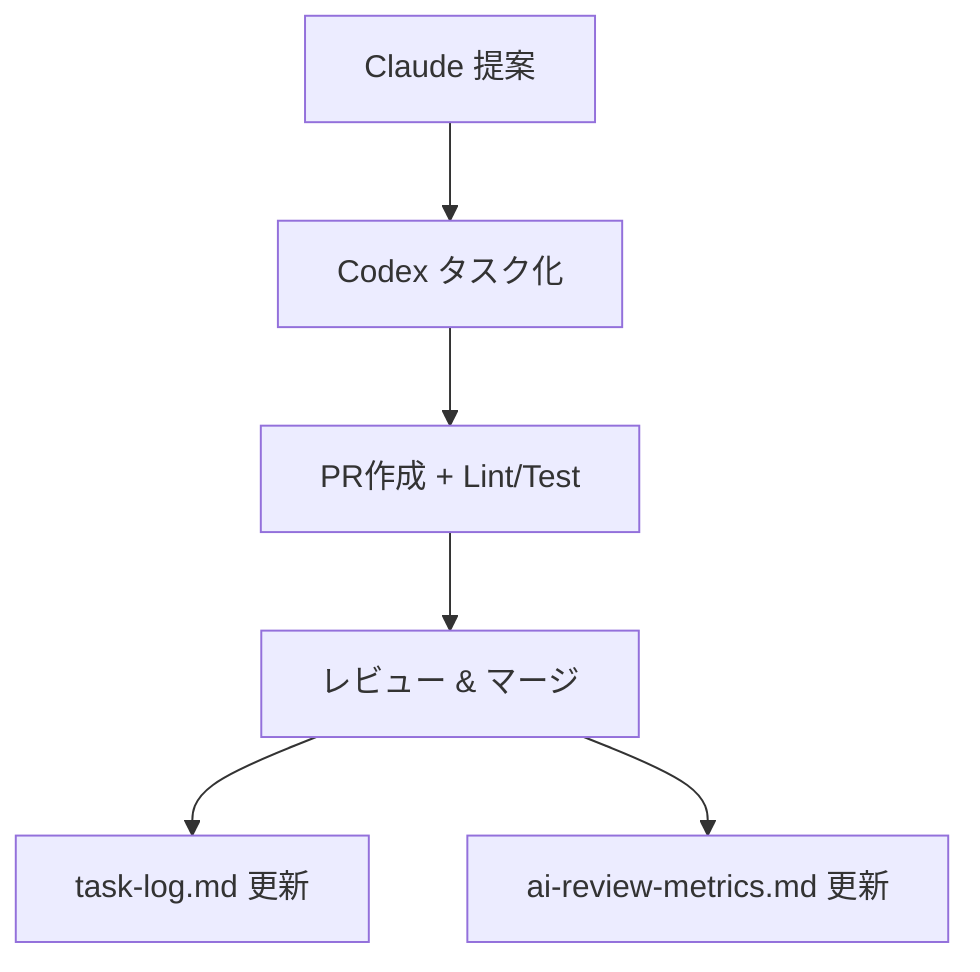

# 🤖 AI自律開発ループスターターキット

GitHub Copilot Agent × Claude × Codex を連携させた「自己完結型AI開発ループ」を、誰でも簡単に構築できるテンプレートです。

---

## 📦 同梱ファイル一覧

| パス | 内容 |
|------|------|
| `002_codex-ultimate-prompt.md` | ✅ Codex用：完全自動構築プロンプト |
| `docs/` | Codex実行ガイド・実行ログ・AI評価指標など |
| `.github/workflows/ci.yml` | Node/Python/PHP対応のCI構成 |
| `scripts/gen-ai-report.sh` | Claude/Copilot向け評価レポート集計 |
| `feedback/claude-tasks/_template.md` | Claude改善提案テンプレート |

---

## 🚀 セットアップ手順

### 1. 初期展開

このリポジトリをクローンまたはZIP展開し、プロジェクト直下に配置。

### 2. Codexに投入！

- Codex Web UI を開き、`002_codex-ultimate-prompt.md` を読み込み
- 「Start Task」で実行
- `.github/`, `docs/`, `feedback/`, `scripts/` などが自動生成されます

---

## 🧠 Claude連携手順

Claudeには `feedback/claude-tasks/_template.md` を渡し、改善提案の際には以下を含めるよう指示：

- **対象ファイル名**
- **行番号 or セクション**
- **改善カテゴリ + 重要度**

---

## 🛠 GitHub Actions / CI構成

- Lint / Test / Deploy のトリガーを自動構成（Node.js, Python, PHP）
- `scripts/gen-ai-report.sh` は **毎週月曜3時** にレポートを生成（要 schedule 設定）

---

## 📊 評価と記録の仕組み

| ファイル | 内容 |
|---------|------|
| `docs/task-log.md` | タスク実行履歴（自動更新） |
| `docs/metrics/ai-review-metrics.md` | Claude / Copilot Agent のパフォーマンス記録 |
| `docs/logs/` | 古いタスクログの自動アーカイブ先 |

---

## 🔐 ブランチ保護の推奨設定

Codexは以下の `main` 保護設定を自動で行います：

- ✅ CI必須
- ✅ 1件以上のレビュー
- ✅ 管理者にも保護適用

---

## 🤝 自動ループの流れ

---

## 💡 拡張したいときは？

CodexまたはClaudeに「提案タスクとして登録して！」と伝えるだけでOK✨
