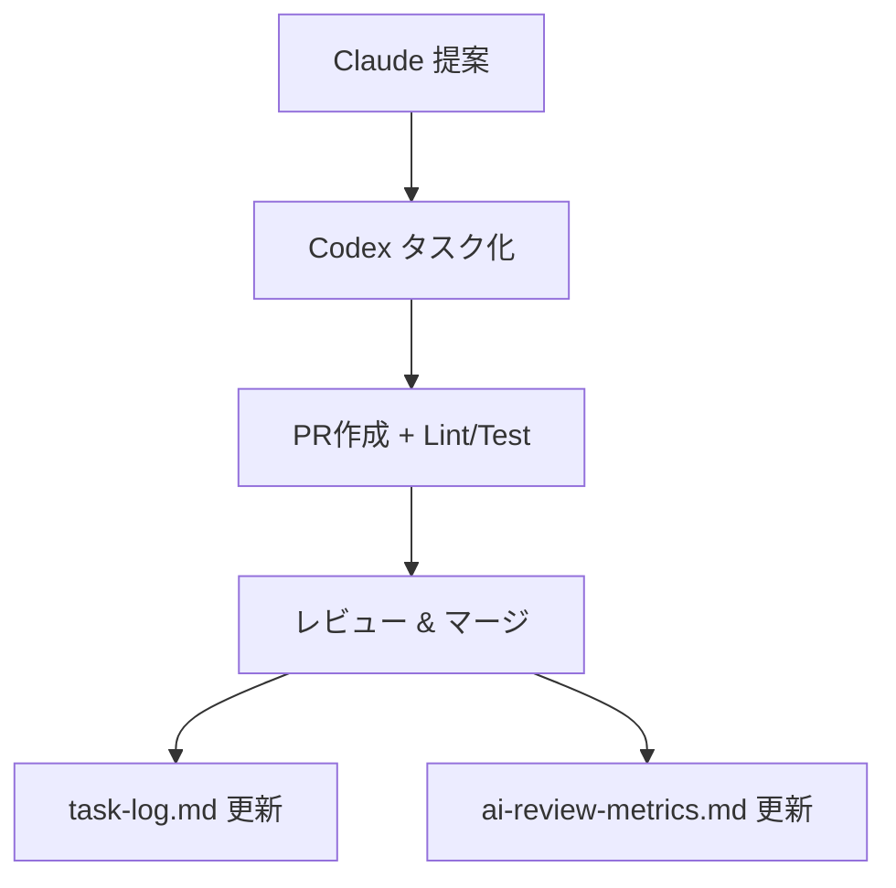

# 🤖 AI自律開発ループスターターキット

GitHub Copilot Agent × Claude × Codex を連携させた「自己完結型AI開発ループ」を、誰でも簡単に構築できるテンプレートです。

---

## 📦 同梱ファイル一覧

| パス                                   | 内容                                       |
| ------------------------------------ | ---------------------------------------- |
| `codex-ultimate-prompt.md`           | ✅ Codex用：完全自動構築プロンプト（コードブロック付きでファイル展開）   |
| `docs/`                              | Codex実行ガイド・実行ログ・AI評価指標など                 |
| `.github/workflows/ci.yml`           | Node/Python/PHP対応のCI構成（週次・日次・pushトリガー対応） |
| `scripts/`                           | Claude解析・レポート作成・ログ管理のスクリプト群              |
| `feedback/claude-tasks/_template.md` | Claude改善提案テンプレート                         |

---

## 🚀 セットアップ手順

### 1. 初期展開

このリポジトリをクローンまたはZIP展開し、プロジェクト直下に配置。

### 2. Codexに投入！

* Codex Web UI を開き、`codex-ultimate-prompt.md` を読み込み
* 「Start Task」で実行
* `.github/`, `docs/`, `feedback/`, `scripts/` などが自動生成されます

---

## 🧠 Claude連携手順

Claudeには `feedback/claude-tasks/_template.md` を渡し、改善提案の際には以下を含めるよう指示：

* **対象ファイル名**
* **行番号 or セクション**
* **改善カテゴリ + 重要度**

Claudeが生成したフィードバックは、`scripts/parse-claude-feedback.py` により自動解析され、`tasks/` ディレクトリに JSON タスク化されます。

---

## 🛠 GitHub Actions / CI構成

* Lint / Test / Deploy のトリガーを自動構成（Node.js, Python, PHP）
* `gen-ai-report.sh` は **毎週月曜3時** にレポート生成
* `archive-task-log.sh` は **毎日0時** にログ整理
* `parse-claude-feedback.py` は Claude 提案の push 時に実行

---

## 📊 評価と記録の仕組み

| ファイル                                | 内容                                |
| ----------------------------------- | --------------------------------- |
| `docs/task-log.md`                  | タスク実行履歴（最大50件、超過でアーカイブ）           |
| `docs/metrics/ai-review-metrics.md` | Claude / Copilot Agent のパフォーマンス記録 |
| `docs/logs/`                        | 古いタスクログの自動アーカイブ先                  |

---

## 🔐 ブランチ保護の推奨設定

Codexは `main` ブランチに以下の保護設定を提案します（手動で `gh api` 実行）：

* ✅ CI必須
* ✅ 1件以上のレビュー
* ✅ 管理者にも保護適用

詳細なコマンドは `docs/codex-usage-guide.md` に記載されています。

---

## 🤝 自動ループの流れ

---

## 💡 拡張したいときは？

CodexまたはClaudeに「提案タスクとして登録して！」と伝えるだけでOK✨
