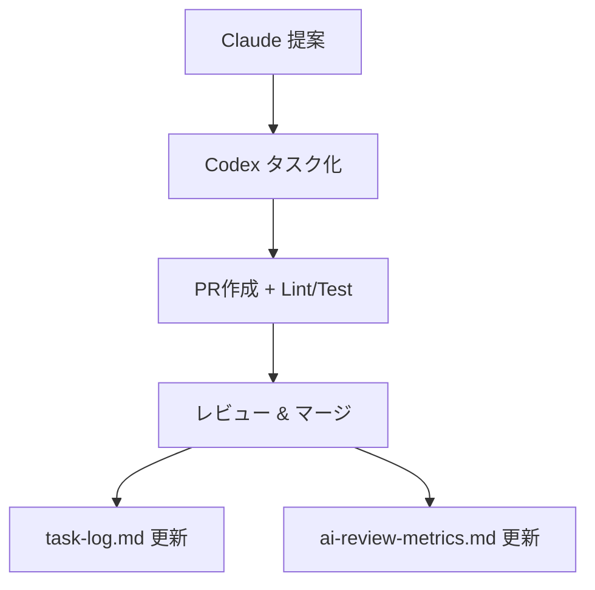

# 🤖 AI 自律開発ループスターターキット

## プロジェクト概要

本プロジェクトは、GitHub Copilot Agent・Claude・Codex など複数 AI を連携し、AI 自律開発ループ（タスク生成 →PR レビュー → フィードバック蓄積 → 評価指標出力 →CI/CD 連携）を自動化・継続的に実行するためのスターターキットです。

- **Codex**: タスク自動生成・ファイル展開・履歴管理
- **Copilot Agent**: PR 作成・Lint/Test・自動レビュー
- **Claude**: 改善提案・フィードバック生成

---

## 📦 ディレクトリ・ファイル構成

| パス                                 | 内容                                                               |
| ------------------------------------ | ------------------------------------------------------------------ |
| `codex-ultimate-prompt.md`           | Codex 用：完全自動構築プロンプト（ファイル展開仕様含む）           |
| `AGENT.md`                           | 各 AI エージェントの設計方針・運用ルール・拡張指針                 |
| `docs/`                              | 実行ガイド・タスクログ・AI 評価指標・レポート等                    |
| `.github/workflows/ci.yml`           | Node/Python/PHP 対応の CI 構成（週次・日次・push トリガー対応）    |
| `scripts/`                           | Claude 解析・レポート作成・ログ管理の自動化スクリプト群            |
| `feedback/claude-tasks/_template.md` | Claude 改善提案テンプレート                                        |
| `tasks/`                             | Claude フィードバックから自動生成される JSON タスク群              |
| `install.sh`                         | セーフインストール用スクリプト（既存ディレクトリ自動バックアップ） |

---

## 🚀 セットアップ・運用手順

### 1. 初期展開

- このリポジトリをクローンまたは ZIP 展開し、プロジェクト直下に配置
- `install.sh` を実行すると `.github/`, `docs/`, `feedback/`, `scripts/` などが自動生成・バックアップされます

### 2. Codex に投入

- Codex Web UI で `codex-ultimate-prompt.md` を読み込み「Start Task」で実行
- 指定ディレクトリ・ファイルが自動展開されます

---

## 🧠 Claude 連携・フィードバック運用

- Claude には `feedback/claude-tasks/_template.md` を渡し、改善提案時は
  - 対象ファイル名
  - 行番号 or セクション
  - 改善カテゴリ + 重要度
    を必ず含めるよう指示
- Claude が生成したフィードバックは `scripts/parse-claude-feedback.py` で自動解析され、`tasks/` ディレクトリに JSON タスク化
- Claude 提案はテンプレートに従い `feedback/claude-tasks/` に保存

---

## 🛠 自動化スクリプト・CI/CD 構成

- `.github/workflows/ci.yml` で Lint/Test/Deploy を自動化（Node.js, Python, PHP）
- `gen-ai-report.sh` で週次 AI レポート自動生成
- `archive-task-log.sh` でタスクログ自動アーカイブ（50 件超で分割保存）
- `parse-claude-feedback.py` で Claude 提案を自動タスク化

---

## 📊 評価・記録・アーカイブ

| ファイル                            | 内容                                               |
| ----------------------------------- | -------------------------------------------------- |
| `docs/task-log.md`                  | タスク実行履歴（最大 50 件、超過で自動アーカイブ） |
| `docs/metrics/ai-review-metrics.md` | Claude / Copilot Agent のパフォーマンス記録        |
| `docs/logs/`                        | 古いタスクログの自動アーカイブ先                   |
| `docs/reports/`                     | 週次 AI レポート自動生成先                         |

---

## 🔄 AI 自律開発ループの流れ

---

## 🛡️ ブランチ保護・推奨運用

- `main` ブランチは CI 必須・1 件以上のレビュー・管理者にも保護適用を推奨
- 詳細コマンドは `docs/codex-usage-guide.md` 参照

---

## 💡 拡張・カスタマイズ指針

- 新規エージェント追加時は `AGENT.md` に追記
- Claude 提案はテンプレートに従い `feedback/claude-tasks/` に保存
- 解析スクリプトで `tasks/` に JSON 化
- 50 件超のタスクログは自動アーカイブ

---

## 参考

- `AGENT.md` ...エージェント設計・運用ルール
- `codex-ultimate-prompt.md` ...Codex 用プロンプト・展開仕様
- `docs/metrics/ai-review-metrics.md` ...AI 評価指標

---

最終更新: 2025-06-08
